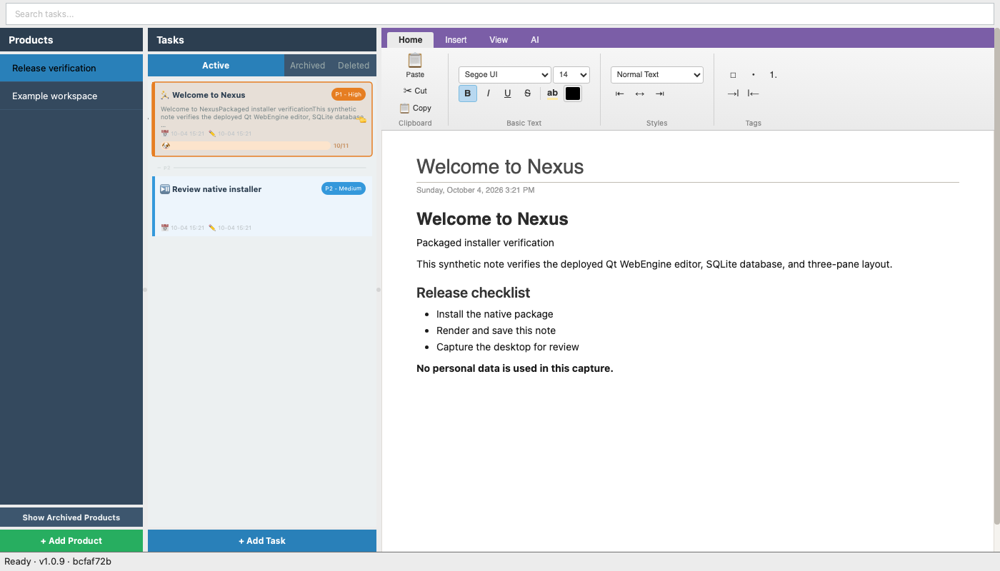
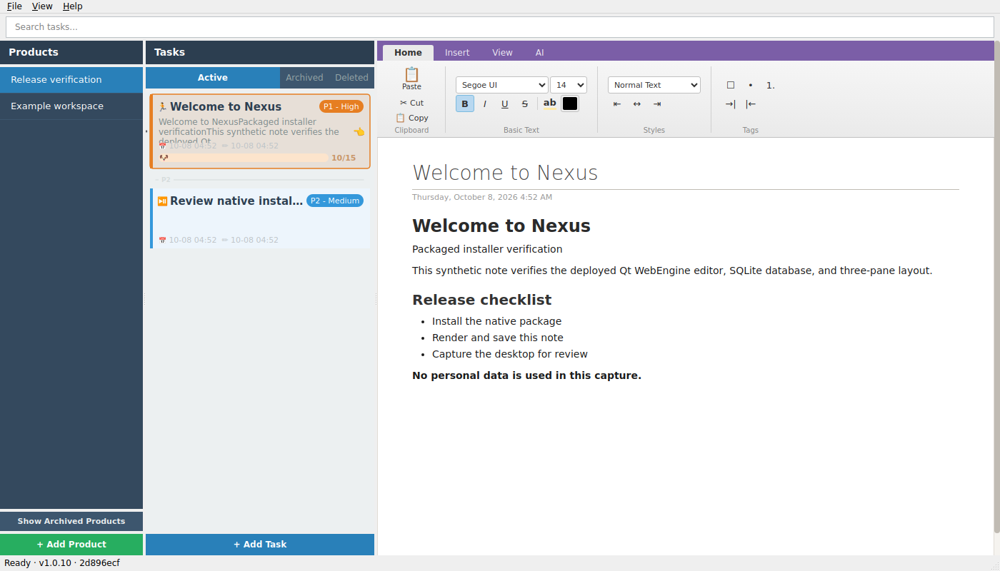
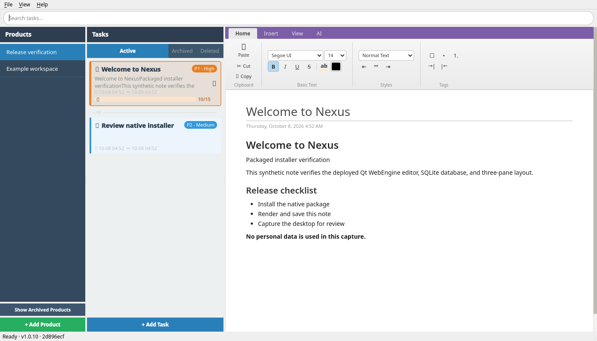

# Nexus

A desktop task management application with a 3-pane layout inspired by OneNote, built with C++17 and Qt 6.


## Download and install

Download native packages from the
[primary releases](https://github.com/jelllove/Nexus/releases).
An access-controlled mirror is published to
[qinqiangxu/Nexus](https://github.com/qinqiangxu/Nexus/releases) using the same
verified commit and assets.
The previous `qinqingxu/Nexus` address redirects to this renamed mirror.

### v1.0.12 packages

| Platform | Release asset | Installation |
| --- | --- | --- |
| Windows 10/11 x64 | `Nexus-Setup-v1.0.12-x64.exe` | Run the installer; shortcuts launch the deployed application. |
| Windows x64 portable | `Nexus-1.0.12-Windows-x64.zip` | Extract the entire archive and run `Nexus.exe`. |
| macOS Apple Silicon | `Nexus-1.0.12-macOS-arm64.dmg` | Mount the image, copy Nexus into Applications, then launch it. |
| Ubuntu 22.04/24.04 x64 | `Nexus-1.0.12-Linux-x64.deb` | `sudo apt install ./Nexus-1.0.12-Linux-x64.deb` |
| Fedora 43/44 x64 | `Nexus-1.0.12-Linux-x64.rpm` | `sudo dnf install ./Nexus-1.0.12-Linux-x64.rpm` |
| Linux x64 portable | `Nexus-1.0.12-Linux-x64.tar.gz` | Extract the entire archive and run its `bin/nexus-launch`. |

Do not extract only the executable: the Qt runtime and WebEngine resources are
required. Intel macOS and Linux ARM64 can be built from source with matching Qt
libraries but are not included in the current release matrix. macOS packages
are unsigned/unnotarized; Linux uses Ubuntu 22.04 as its compatibility baseline.

Release downloads also include `SHA256SUMS`, native app-window/desktop PNGs,
and macOS/Linux installer-evidence ZIPs. The screenshots show synthetic sample
notes, not personal data. See [v1.0.12 release notes](docs/release-notes-v1.0.12.md).
This release fixes the Windows updater's temporary-file lock and opens the
official download website when a download or package launch fails.
Earlier releases and their assets remain unchanged.

### Linux package-manager installation

After installing the DEB/RPM, launch **Nexus** from the desktop menu or run
`nexus` in a terminal. Private Qt files live in `/opt/nexus`; notes and settings
remain in your user data directory. Quit Nexus before upgrading.

```sh
# Ubuntu 22.04/24.04 x64
sudo apt install ./Nexus-1.0.12-Linux-x64.deb
# Fedora 43/44 x64
sudo dnf install ./Nexus-1.0.12-Linux-x64.rpm
```

Uninstall with `sudo apt remove nexus` or `sudo dnf remove nexus`; this does not
delete notes/settings. Install local packages with apt/dnf rather than ignoring
their dependencies. These files are not signed packages or an apt/yum repository.
Debian, Rocky/RHEL and other distributions are not claimed without verification.
See [native Linux packaging design](docs/linux-native-packages.md).

### Native installer screenshots

These reference captures are from v1.0.10 installed native packages on
GitHub-hosted runners using synthetic notes; Linux uses an Xvfb desktop.
Each new release includes its own version-specific screenshots and evidence.

**macOS Apple Silicon**



**Linux x64**


**Ubuntu 24.04 DEB installation**



**Fedora 44 RPM installation (container desktop)**



## Features

- **3-Pane Layout** — Products (notebooks) → Tasks (pages) → Rich Editor, with a resizable splitter
- **Rich Text Editor** — TipTap-based WYSIWYG editor embedded via QWebEngineView, supporting headings, lists, code blocks, images, and more
- **Task Cards** — Visual task cards with priority badges (P0–P3), color-coded priority bars, created/modified timestamps, and due-date progress bars with cute animal icons
- **Sub Task Work Status** — Sub tasks support the same 5 statuses as main tasks (Not Started/Ongoing/Paused/Completed/Waiting), rendered as smaller status icons with click-to-change popups
- **Sub Task Movement** — Drag subtasks to reorder or move between visible main tasks, with drop indicators and edge scrolling; a right-click menu also offers up/down actions and a searchable destination picker
- **Due Dates & Progress** — Set due dates on tasks; a day-based progress bar shows time elapsed with green/orange/red color coding
- **Full-Text Search** — SQLite FTS5-powered global search across Active/Archived/Deleted task titles and content, rendered directly in the task list with context restore on clear
- **Priority Management** — Click the priority badge or right-click to change task priority; tasks auto-sort by priority then due date
- **Active / Archived Toggle** — Quick-switch between active and archived tasks with toggle buttons
- **Product Ordering & Archive** — Drag to reorder products, archive/reactivate products, and expand archived products below the active list
- **System Tray** — Minimize to tray when available; otherwise save and exit on close
- **Global Hotkey** — Control+Shift+N using Win32, macOS Carbon, or Linux X11; native Wayland hotkeys are not supported
- **GitHub Release Auto-Update** — Checks on startup and every 6 hours (including in the system tray), asks before downloading, supports 1/2/3-month reminder pauses, and shows cancellable download progress
- **AI Integration** — OpenAI-compatible API for AI-powered title generation from task content
- **Image Support** — Paste or drag images into the editor; stored locally in the platform's application-data directory
- **Content History** — Automatic snapshots for undo/redo support
- **Markdown Export** — Export selected Active tasks via Product → Main Task → Sub Task selection, optional AI one-line summaries with extra confirmation, progress dialog with logs/cancel, and a nested pure-Markdown tree output
- **Markdown Preview** — Reuse the same selection/summarization pipeline and open a non-modal preview window with `Copy Markdown`, `Copy HTML`, and `Save As .md`
- **Database Maintenance** — Daily `VACUUM INTO` backups and delayed weekly background compaction (`wal_checkpoint(TRUNCATE)` + `VACUUM`)

## Architecture

```
src/
├── app/           MainWindow (3-pane coordinator)
├── db/            DatabaseManager (SQLite + FTS5, WAL mode)
├── models/        Product & Task structs, Qt list models
├── ui/            ProductPane, TaskPane, TaskCardDelegate,
│                  EditorPane, SearchBar, SettingsDialog, MarkdownPreviewDialog
├── editor/        EditorBridge (C++ ↔ JS via QWebChannel)
├── services/      AIService, ImageManager
└── platform/      GlobalHotkey (Win32/Carbon/X11), UpdatePackage

resources/
└── editor/        TipTap HTML/CSS/JS bundle
```

## Prerequisites

### Windows

- **Windows 10/11**
- **Visual Studio 2022** (MSVC v14.44+)
- **Qt 6.8.3** (msvc2022_64) — install via [aqtinstall](https://github.com/miurahr/aqtinstall):
  ```
  pip install aqtinstall
  aqt install-qt windows desktop 6.8.3 win64_msvc2022_64
  aqt install-qt windows desktop 6.8.3 win64_msvc2022_64 -m qtwebengine qtwebchannel qtpositioning
  ```
- **CMake 3.21+** (bundled with VS2022)
- **Node.js 22+** and npm for editor validation and rebuilding the TipTap bundle

### macOS

- macOS 12+ and Xcode Command Line Tools (`xcode-select --install`).
- Qt 6.8.3 for macOS (`clang_64`), including Qt WebEngine, WebChannel and Qt Test.
- CMake 3.21+.
- Select an architecture supported by the installed Qt libraries (`arm64` on
  Apple Silicon, `x86_64` on Intel). A universal build requires universal Qt.

### Linux

- Ubuntu 22.04+ is the reference build environment; other distributions require
  compatible system libraries. This is not a universal AppImage.
- GCC/Clang with C++17, CMake 3.21+, Qt 6.8.3 (`gcc_64`) including WebEngine,
  WebChannel and Qt Test.
- X11 development headers are required for the hotkey backend, even when the
  app is run under Wayland. Install build/runtime dependencies on Ubuntu:

  ```sh
  sudo apt-get install build-essential cmake libx11-dev libgl1-mesa-dev \
    libegl1-mesa-dev libxcb-cursor0 libxkbcommon-x11-0 libxcb-xinerama0 \
    libnss3 libasound2 libxcomposite1 libxrandr2 libxtst6 libxdamage1 \
    libgbm1 libfontconfig1 libdbus-1-3 libopengl0 libxcb-shape0
  ```

Qt's online installer or `aqtinstall` can supply Qt on all three platforms.
For example, `aqt install-qt linux desktop 6.8.3 linux_gcc_64 -m qtwebengine
qtwebchannel qtpositioning` (use `mac desktop 6.8.3 clang_64` on macOS).

## Build

### Windows quick build

Double-click or run from a terminal:

```bat
build.bat
```

This will configure, build, deploy Qt DLLs, and package everything into the `dist/` directory.

### Manual Build

Windows:

```bash
# Configure
cmake -S . -B build -G "Visual Studio 17 2022" -A x64 -DCMAKE_PREFIX_PATH=C:/Qt/6.8.3/msvc2022_64

# Build
cmake --build build --config Release

# Deploy Qt runtime
C:/Qt/6.8.3/msvc2022_64/bin/windeployqt6.exe build/Release/Nexus.exe
```

macOS/Linux (replace `QT_PREFIX` with the installed Qt directory):

```sh
cmake -S . -B build -DCMAKE_BUILD_TYPE=Release -DBUILD_TESTING=ON \
  -DCMAKE_PREFIX_PATH="$QT_PREFIX"
cmake --build build --config Release --parallel 2
export PATH="$QT_PREFIX/bin:$PATH"
ctest --test-dir build -C Release --output-on-failure
```

On macOS, optionally pass `-DCMAKE_OSX_ARCHITECTURES=arm64` or `x86_64`.
To deploy Qt and create a distributable package on any platform:

```sh
cpack --config build/CPackConfig.cmake -C Release
```

Packages are written to `build/packages`: Windows ZIP (portable deployment),
macOS DMG, Linux tar.gz. Windows `.exe` installers still use the existing
release tooling. CMake/CPack deploy the Qt libraries, plugins, WebEngine helper
and resources rather than shipping only the application executable.
macOS builds are not Developer ID signed/notarized; public distribution
requires a separate signing workflow. Only install packages from a trusted source.

For Linux DEB/RPM packaging, install `rpm` build tools and package the deployed
runtime through the separate packaging project:

```sh
cmake --install build --config Release --prefix "$PWD/build/linux-stage"
cmake -S packaging/native -B build/native-packages \
  -DNEXUS_STAGE="$PWD/build/linux-stage"
cpack --config build/native-packages/CPackConfig.cmake
```

The packages appear under `build/native-packages/packages`; CI copies them into
the normal release package directory. Package generators use the same deployed
app as the portable archive, with separate DEB/RPM dependency declarations.

## Run

Windows quick-build output:

```
dist\Nexus.exe
```

macOS: `open build/Nexus.app`, or copy the packaged application into Applications.
Linux: `./build/Nexus` while developing with Qt installed; after extracting the
package, run `./bin/nexus-launch` from the extracted package directory. The
launcher resolves bundled libraries relative to its own location.
The portable Windows ZIP contains `Nexus.exe` at its root, preserving the
existing Windows installation layout for upgrades and shortcuts.

The database (`nexus.db`) uses Qt's application-data location by default:

- Windows: `%APPDATA%\Nexus\Nexus\`
- macOS: `~/Library/Application Support/Nexus/Nexus/`
- Linux: `${XDG_DATA_HOME:-~/.local/share}/Nexus/Nexus/`

Custom database paths and existing settings remain supported. See
[cross-platform design and acceptance criteria](docs/cross-platform.md) for
platform boundaries, deployment decisions, and verification limitations.

## Moving subtasks

- Drag a subtask by its title or dotted grip. A blue line above/below another
  subtask indicates the insertion position, including under a different parent.
- Drop on a main-task card to append there (also works with collapsed or empty
  main tasks). The destination is expanded and the moved subtask selected.
  Dropping in the blank space below the list appends to the last main task.
- Hold near the top/bottom of the list to scroll while dragging. **Esc**, release
  outside the list, loss of focus, or a list refresh cancels the drag. Clicking without dragging
  still opens the editor; clicking the status icon still opens its status menu.
- Expand a main task, then right-click a subtask and choose **Move Up** or
  **Move Down** to change its order. The first/last boundary action is disabled.
- Choose **Move to Main Task...**, search by product or main-task title, select
  the destination and click **Move**. Task IDs distinguish duplicate titles.
  Active and archived main tasks in active or archived products are supported.
- Moving via the destination picker appends the subtask at the end, opens that
  destination and selects the moved subtask. Use **Move Up** afterwards to
  adjust its position. Reparenting from search exits search; reordering stays
  in the current search results.
- A move preserves the subtask's identity, title, rich content and work status.
  The current editor note is saved before moving; save failures block the move.
  Database moves are atomic and the order persists across restarts and is used
  by Markdown export/preview.
- Deleted main tasks cannot be sources or destinations until restored.
  Dragging works within the current task list, including search results.
  Use the destination picker for main tasks in other products that are not
  visible in the current list. This is internal movement, not a file export.

### Trying a different local build

Nexus only runs one instance at a time. Launching a different executable while
an older copy is running brings the **older copy** to the front; it does not
switch builds. Closing the window only hides it in the system tray.
Before trying a new local build, allow pending edits to autosave, then use
**File > Quit** (**Ctrl+Q**) or the tray's **Quit**, and launch the new executable.

## Update checks

- **Settings > Updates** controls automatic startup and six-hour checks; changes take effect immediately.
- A new release opens **Update Available** with **Yes** and **Not now**. Downloads only start after **Yes**, including for users who previously enabled automatic downloading; that old setting is no longer used.
- **Not now**, Escape, or closing the prompt postpones reminders for six hours by default. Select **Don't ask for 1/2/3 months** before choosing **Not now** to pause automatic prompts for that many calendar months (clamped to the last day for shorter months).
- The UTC reminder deadline is saved in the current database and survives restarts. It covers all release versions; background checks continue during the pause. After expiry, the next scheduled check can remind you again.
- **Help > Check for Updates** bypasses paused reminders and disabled automatic checks. Choosing **Not now** with the default six-hour option does not shorten an existing longer pause; choosing **Yes** clears it. Settings displays the pause deadline in local time.
- **Yes** opens a download dialog showing percentage and downloaded/total size. If the server does not report a total, progress is indeterminate with the received size. **Cancel** or closing the download window aborts the download without starting an installer, and manual checks can retry.
- Checks and downloads cannot overlap. Background errors are logged and shown in the status bar, not an error popup; the next scheduled check can retry.
- Download failures close the progress dialog and show an error. No partial installer is launched.
- Download/save failures and failures to launch/open a downloaded package automatically open the [official Nexus download page](https://www.jelllove.com/products/nexus.html) for manual installation. Nexus stays open; the error dialog includes a selectable download URL and explains if the browser could not be opened.
- Cancelling or deferring an update, background check errors and note-save failures do not open the download page. Nexus detects download and package-launch failures, not failures inside an external installer after it has successfully started.
- After download, Windows **Install now** saves the current task or subtask before launching the installer and quitting. On macOS/Linux, **Open update** saves the note, opens the DMG/folder, and keeps Nexus running. Quit Nexus before manually installing the replacement. Save/open failures leave Nexus open.
- Choose **Later** to keep working; use **Help > Check for Updates** to reopen the downloaded update without downloading it again during the same session.
- Checking requires Nexus to be running and the computer awake. This is not a background service; the Windows installer may require UAC confirmation.

### Windows installer launch troubleshooting

Downloads use a unique `Nexus-Update-XXXXXX.exe` filename in the current user's
temporary directory. The download file must release its writable handle before
the update-ready notification; calling `QTemporaryFile::close()` alone does not
release that handle. v1.0.12 releases it before notifying the UI.
A regression test launches a harmless test executable
directly from that notification to verify this handoff.

In v1.0.11 and earlier, choosing **Install now** immediately after downloading can fail
because the file is still open. Choose **Later** first, then use
**Help > Check for Updates** to reopen the cached download and choose
**Install now**. Alternatively, save your notes, quit Nexus and manually run
the trusted downloaded installer. Changing the filename or elevating Nexus is
not needed to resolve this file-handle lifetime issue.

Updates only select matching OS/CPU packages. Supported release asset names:

- Windows: `Nexus-Setup-v<version>-x64.exe` (or `arm64`)
- macOS: `Nexus-<version>-macOS-x64.dmg` (or `arm64`, `universal`)
- Linux: `Nexus-<version>-Linux-x64.tar.gz` (or `arm64`)

If a release has no matching package, the updater reports an error instead of
downloading a Windows installer on another OS. CI produces packages, but does
not publish a release until all tag-build, editor and native installer checks pass.

## Desktop integration

The global shortcut is **Control+Shift+N**, including on macOS (not Command).
On Wayland, Settings explains the limitation; use your desktop's shortcut
settings to launch Nexus, which asks an already-running instance to show itself.
When no tray is available, closing saves the active note and exits rather than
leaving an inaccessible background process. macOS can restore a hidden window
when the application is activated from the Dock.

## Tests

With the Qt Test component installed, configure with `-DBUILD_TESTING=ON`, build,
then run `ctest --test-dir build -C Release --output-on-failure`.
On Windows, add your Qt `bin` directory to `PATH` before running tests.
Test reports are saved in `build/UpdateServiceTest.txt`, `build/UpdateUiTest.txt`
and `build/SubtaskMoveTest.txt`, plus `build/UpdatePackageTest.txt`; test executables are kept separately under
`build/tests`. Update tests use a fake network (no GitHub access or real installers)
and a temporary database to verify the exact six-hour interval, persistent
1/2/3-month pauses, expiry/manual overrides, required download consent, progress,
cancellation, error handling, cached downloads and save-before-install protection.
The subtask suite uses an isolated temporary database and covers
ordering, reparenting, field preservation, rollback, the destination picker,
mouse dragging, drop indicators, cancellation, edge scrolling, editor saves
and selection.

CI runs the Qt and installer-helper suites, build and packaging on Windows, macOS and Ubuntu.
Package-selection unit tests cover all three platforms even on a single host.
Native hotkey registration, Dock activation and packaged launches still require
platform-native desktop smoke tests. The offscreen suites do not simulate hotkeys
or Dock activation; installed-package CI now checks native packaged launches.

## Installer verification and screenshots

The [Build workflow](.github/workflows/build.yml) runs on pushes to `main` and
`agents/macos-support`, PRs targeting `main`, and manual **Run workflow**.
After packaging, separate **Verify macOS/Linux installer and screenshots** jobs
download the generated artifacts onto fresh runners with no development Qt
installation:

- **macOS:** mount the DMG read-only, copy `Nexus.app` into a clean directory,
  unmount it, and launch the installed application.
- **Linux:** extract the tar.gz safely, run `bin/nexus-launch` under a
  1600x1000 Xvfb desktop with Fluxbox and D-Bus.
- Both use synthetic notes in an isolated database, disable update requests,
  verify actual editor DOM rendering and note saving, then capture screenshots.
  Missing/blank captures, failed startup/render/save and timeouts fail the job.

For package-only diagnosis, manually run the workflow with `package_run_id`
set to a completed build run's numeric ID. This reuses its packages on fresh
verification hosts and does not build or publish a release. Leave it empty
for normal full verification. Linux logs include Qt plugin-loader diagnostics.

To review captures, open **GitHub Actions > Build > the run > Artifacts** and
download:

- `Nexus-macOS-installer-evidence`
- `Nexus-Linux-installer-evidence`

Each artifact includes `screenshots/app-window.png`, `screenshots/desktop.png`,
`screenshots/report.json`, `verification.json`, `install.log`, and
`application.log`. The workflow summary links these downloads. Evidence is kept
for **14 days**, including diagnostics on failure; unsuccessful runs may not
have screenshots. Linux captures show a virtual desktop, not a physical monitor.
The archive/DMG checks do not exercise Gatekeeper prompts, signing/notarization
or native hotkeys. Additional native-package jobs install/reinstall/remove DEBs
on Ubuntu 22.04/24.04 and RPMs in Fedora 43/44 containers, verify menu/icon/launcher,
capture rendered-note screenshots as an unprivileged user and check that removal
preserves user data. Their evidence artifacts use names such as
`Nexus-Ubuntu-24.04-DEB-installer-evidence` and `Nexus-Fedora-44-RPM-installer-evidence`.

The [installer verifier](ci/verify_installer.py) requires Python 3.12+ on native
macOS/Linux hosts. Run it inside an existing desktop session (or `xvfb-run` on
Linux):

```sh
python ci/verify_installer.py --package path/to/Nexus-package.dmg \
  --evidence installer-evidence
```

Use the `.tar.gz` path on Linux. The evidence directory must not already exist.
For a direct smoke capture using an installed executable:

```sh
Nexus --installer-smoke /absolute/path/to/new-capture-directory
```

This explicit verification mode bypasses normal single-instance IPC and user
settings/database paths; normal application startup is unchanged. It exits
after screenshots or fails after at most 60 seconds of readiness checks.
Python helper/CLI regressions are part of the ordinary CTest command; Python
3.12+ is required when `BUILD_TESTING=ON`.

## Publishing a release

The primary repository is `jelllove/Nexus`; `qinqiangxu/Nexus` is the private
mirror previously named `qinqingxu/Nexus`.
Release integration is pushed on `agents/release-*`; cross-platform work may
also use `agents/macos-support`. After verification, `main`
can be fast-forwarded to the same commit without rewriting existing history.
Use a new version tag only after the branch's native build and installer
verification jobs pass. A tag must match the CMake application version.

```sh
git push origin agents/release-v1.0.12
# After the branch workflow passes:
git push origin HEAD:main
git tag -a v1.0.12 -m "Nexus v1.0.12"
git push origin v1.0.12
```

The tag workflow checks editor syntax and bundle reproducibility, runs all nine
CTest suites on each platform, builds all three platforms, verifies installed macOS/Linux
packages and screenshots, requires all four DEB/RPM lifecycle jobs, creates the Windows Inno Setup installer from the
deployed runtime, and publishes a GitHub release only after these gates pass.
Missing packages/evidence or a version mismatch block publication. Mirror
releases reuse these verified assets rather than claiming a second validation.
The legacy `release.bat` is Windows-only; the CI tag workflow is the
cross-platform release path.

On an interactive Windows desktop, the `systemMouseDrag` cases additionally use
Windows `SendInput` and system cursor movement, rather than direct Qt widget
events. They use a temporary database, move the mouse during the test, and are
skipped in the normal offscreen suite. With Qt `bin` on `PATH`, run them with:

```powershell
$env:QT_QPA_PLATFORM = "windows"
$env:QT_PLUGIN_PATH = "C:\Qt\6.8.3\msvc2022_64\plugins"
.\build\tests\Release\SubtaskMoveTest.exe systemMouseDrag -o ".\build\SubtaskSystemMouseTest.txt,txt"
```

## Development checks

On Windows, run the validation helper from PowerShell:

```powershell
.\scripts\validate.ps1 -QtRoot C:\Qt\6.8.3\msvc2022_64
```

The helper finds CMake on PATH or in Visual Studio 2022 (including Build Tools),
builds the application and tests, runs CTest, and checks editor JavaScript syntax.
It does not deploy the application or copy your database. `-QtRoot` defaults to
`QT_ROOT`, or `C:\Qt\6.8.3\msvc2022_64` when that environment variable is unset.
Use `-BuildDirectory` and `-Configuration Debug` for a separate debug build.

For manual validation, configure using the instructions above with
`-DBUILD_TESTING=ON`, then run:

```powershell
cmake --build build --config Release
ctest --test-dir build -C Release --output-on-failure --no-tests=error
npm --prefix editor-bundle run check
```

On macOS/Linux, use the platform configure instructions above and the same
build/test commands. Core tests use in-memory SQLite; UI tests use an offscreen
desktop, a temporary database and fake update requests, not personal data.
The Windows helper supplies Qt DLLs on the test process PATH; for manual CTest,
add the Qt `bin` directory to PATH first. Set `-DBUILD_TESTING=OFF`
when configuring a packaging-only build that does not need Qt Test.

The regression suite covers product/task lifecycle, due-date ordering, subtasks,
search index updates, settings, model roles and reorder transaction failures.
JUnit results are written to `build/tests/nexus-core.junit.xml`.

To rebuild the editor after changing its dependencies or entry point:

```powershell
npm --prefix editor-bundle ci
npm --prefix editor-bundle run check
npm --prefix editor-bundle run build
```

Commit intentional changes to both the lockfile and generated editor bundle.
The existing PR workflow runs Windows/macOS/Linux tests and a separate editor
syntax/build job that also detects a stale generated bundle, retaining JUnit
results even when tests fail. Syntax validation
is not a full JavaScript linter, and these checks are not GUI end-to-end tests.
Repository administrators must make the workflow checks required in branch
protection; workflow configuration alone does not prevent merging.

## License

MIT License. See [LICENSE](./LICENSE).
